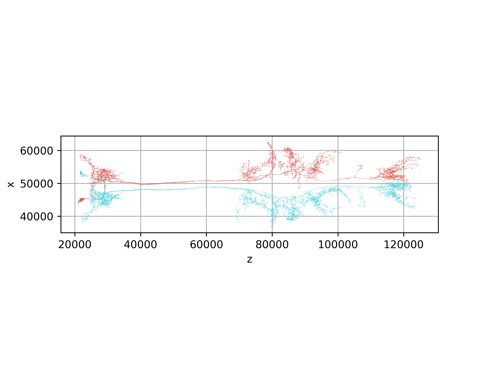

# :fontawesome-solid-download: Download the dataset

=== "Programmatic access"

    You can explore the dataset interactively using the [neuPrint platform](https://neuprint.janelia.org/).
    To access the data programmatically, we recommend using the dedicated Python and R packages:

    === "Python"

        The [`neuprint-python`](https://github.com/connectome-neuprint/neuprint-python) package provides a Python
        interface to the neuPrint API.

        ```bash
        pip install neuprint-python
        ```

        Next, go to [neuPrint](https://neuprint.janelia.org/) and create an account. Follow
        [these instructions](https://connectome-neuprint.github.io/neuprint-python/docs/quickstart.html#client-and-authorization-token)
        for getting your API token.

        ```python
        from neuprint import Client
        client = Client("https://neuprint.janelia.org", api_token="<your_token>")

        # Get neuron annotations and neuropil innervation
        from neuprint import fetch_neurons
        neurons, syndist = fetch_neurons("DNge104")

        # Get connectivity
        from neuprint import fetch_adjacencies
        outgoing_edges, neuron_info = fetch_adjacencies("DNge104")
        incoming_edges, neuron_info2 = fetch_adjacencies(None, "DNge104")
        ```

        For more examples, please see the [neuPrint Github repository](https://github.com/connectome-neuprint/neuprint-python).

        _________________

        If you want to work with neuron morphology, consider using [navis](https://github.com/navis-org/navis). It wraps
        the `neuprint-python` interface and adds functions to read skeletons and meshes as `navis` objects which
        you can then use for visualization and analysis:

        ```bash
        pip install navis[all]
        ```

        ```python
        >>> import navis
        >>> import navis.interfaces.neuprint as neu
        >>> client = Client("https://neuprint.janelia.org", api_token="<your_token>")

        >>> skels = neu.fetch_skeletons(neu.NeuronCriteria(type="DNge104"))
        >>> skels
        <class 'navis.core.neuronlist.NeuronList'> containing 2 neurons (779.2KiB)
                    type       name      id  ...  cable_length soma        units
        0  navis.TreeNeuron  DNge104_R   12781  ...    1558673.00   10  8 nanometer
        1  navis.TreeNeuron  DNge104_L  556329  ...    1690152.25    3  8 nanometer

        >>> fig, ax = navis.plot2d(skels, view=('z', 'x'), radius=True)
        ```

        { width=80% }

        Please see the `navis` [neuPrint tutorial](https://navis-org.github.io/navis/generated/gallery/4_remote/tutorial_remote_00_neuprint/)
        for more examples. Also check out the [flybrains](https://github.com/navis-org/navis-flybrains) extension package and the corresponding
        [tutorial](https://navis-org.github.io/navis/generated/gallery/6_misc/tutorial_misc_01_transforms/) for transforming spatial data
        (such as skeletons or meshes) between male CNS space and other common _Drosophila_ template spaces.


    === "R"

        The [`neuprintr`](https://github.com/natverse/neuprintr) package provides a programmatic
        interface to the neuPrint API for R.

        ```r
        # install
        if (!require("devtools")) install.packages("devtools")
        devtools::install_github("natverse/neuprintr")

        # use
        library(neuprintr)
        ```

        Next, go to [neuPrint](https://neuprint.janelia.org/) and create an account. Follow
        [these instructions](https://connectome-neuprint.github.io/neuprint-python/docs/quickstart.html#client-and-authorization-token)
        for getting your API token.

        ```r
        # Manually initialize the connection - alternatively you can set variables in your .Renviron file
        conn = neuprint_login(server= "https://neuprint.janelia.org/", token= "<your_token>")
        ```

        For more examples, please see the [neuprintr documentation](https://natverse.org/neuprintr/).


=== "Download raw data"

    All connectome data is available for bulk download, suitable for ingestion into alternative databases.
    The following files are stored under `gs://flyem-male-cns/v0.9/connectome-data/flat-connectome/`.

    === "Image data"

        Selected image volumes are described below.  Please inspect the data source URLs in the MaleCNS [neuroglancer scene][scene] for related volumes.

        Except where noted, the image data is available in [neuroglancer precomputed format][precomputed], readable with [`tensorstore`][tensorstore] or [`cloud-volume`][cloud-volume]. Links beginning with `gs://` refer to Google Storage Bucket locations.

        [precomputed]: https://github.com/google/neuroglancer/tree/master/src/datasource/precomputed
        [tensorstore]: https://google.github.io/tensorstore/index.html
        [cloud-volume]: https://github.com/seung-lab/cloud-volume
        [scene]: https://neuroglancer-demo.appspot.com/#!gs://flyem-male-cns/v0.9/male-cns-v0.9.json

        - `gs://flyem_cns_z0720_07m_dvidcoords_n5`
            - The aligned EM volume, uncompressed and without CLAHE normalization, in [N5 format][n5] (supported by tensorstore).
            - 8nm isotropic resolution.
            - Data type `uint8`
            - [Neuroglancer view][em-raw]
        - `gs://flyem-male-cns/em/em-clahe-jpeg`
            - The aligned EM volume, contrast-adjusted with CLAHE normalization and JPEG-encoded.
            - Ideal for interactive browsing.
            - Data type `uint8`
        - `gs://flyem-male-cns/v0.9/segmentation`
            - The `v0.9` proofread neuron segmentation.
            - 8nm isotropic resolution.
            - Voxels are stored as `uint64`, but the upper 32 bits are never used.
        - `gs://flyem-male-cns/v0.9/malecns-v0.9-nuclei-seg-16nm`
            - The `v0.9` nuclear segmentation.  Not filtered to exclude glia, noise, etc.  These served as the basis for our cell body annotations, which were manually reviewed.
            - 16nm isotropic resolution.
            - Voxel datatype is `uint64`.
        - `gs://flyem-male-cns/rois/fullbrain-roi-v4`
            - Brain neuropil compartment segmentation, initialized via transfer from ROIs in JRC2018M and refined manually.
            - 256nm isotropic resolution
            - Voxels are stored as `uint64`, but max value is `96`.
        - `gs://flyem-male-cns/rois/malecns-vnc-neuropil-roi-v0`
            - VNC neuropil compartment segmentation, refined manually.
            - 256nm isotropic resolution
            - Voxels are stored as `uint64`, but max value is `27`.

        [n5]: https://github.com/saalfeldlab/n5
        [em-raw]: https://neuroglancer-demo.appspot.com/#!gs://flyem-user-links/short/male-cns-aligned-em-uncompressed-n5.json

    === "Annotations"

        Neuron-level annotations are provided in [Apache Arrow Feather][feather] file format, which can be read
        using e.g. [`pyarrow`][pyarrow] (Python), [`pandas`][pandas] (Python) or the [`arrow`][arrow] package (R).

        [feather]: https://arrow.apache.org/docs/python/feather.html
        [pyarrow]: https://arrow.apache.org/docs/python/index.html
        [pandas]: https://pandas.pydata.org
        [arrow]: https://arrow.apache.org/docs/r/

        - [body-annotations-male-cns-v0.9-minconf-0.5.feather][body-ann]
            - Curated neuron annotations (classes, types, sides, etc.), excluding neurotransmitter properties.
            - 13 MB
        - [body-neurotransmitters-male-cns-v0.9.feather][body-nt]
            - Aggregate neurotransmitter predictions for each neuron.  See manuscript methods section for details.
            - 42 MB
        - [body-stats-male-cns-v0.9-minconf-0.5.feather][body-stats]
            - summary statistics (synapse counts) of all segments in the dataset (excluding those with no synapses)
            - 780 MB

        [body-ann]: https://storage.googleapis.com/flyem-male-cns/v0.9/connectome-data/flat-connectome/body-annotations-male-cns-v0.9-minconf-0.5.feather
        [body-nt]: https://storage.googleapis.com/flyem-male-cns/v0.9/connectome-data/flat-connectome/body-neurotransmitters-male-cns-v0.9.feather
        [body-stats]: https://storage.googleapis.com/flyem-male-cns/v0.9/connectome-data/flat-connectome/body-stats-male-cns-v0.9-minconf-0.5.feather

    === "Connectivity"

        We provide several tables describing synaptic connectivity in the MaleCNS dataset:

        - [connectome-weights-male-cns-v0.9-minconf-0.5.feather][weights]
            - segment-to-segment connection strengths for all segments in the dataset (excluding those with no synapses)
            - This is the full connection graph.
            - 1.1 GB
        - [syn-points-male-cns-v0.9-minconf-0.5.feather][syn-points]
            - Pre-synapse and post-synapse locations, body (segment) ID, and encompassing ROIs
            - Pre-synapses and post-synapses are listed in separate rows.  The 'kind' column indicates whether the point is `PreSyn` or `PostSyn`.
            - Pre-synapses and post-synapses are uniquely identified by their `x,y,z` locations (expressed in voxel units, i.e. 8nm).
            - In the partner table (below), a single pre-synapse may connect to multiple post-synapses.  In this table, each unique pre-synaptic location is listed only once.
            - 12.7 GB
        - [syn-partners-male-cns-v0.9-minconf-0.5.feather][syn-partners]
            - Synaptic partner pairs, along with their associated body IDs and primary neuropil.
            - Columns: `'x_pre', 'y_pre', 'z_pre', 'body_pre', 'conf_pre', 'x_post', 'y_post', 'z_post', 'body_post', 'conf_post', 'primary_post'`
            - 6.8 GB
        - [tbar-neurotransmitters-male-cns-v0.9.feather][tbar-nt]
            - Neurotransmitter prediction probabilities for each pre-synapse
            - 2.7 GB

        [weights]: https://storage.googleapis.com/flyem-male-cns/v0.9/connectome-data/flat-connectome/connectome-weights-male-cns-v0.9-minconf-0.5.feather
        [syn-partners]: https://storage.googleapis.com/flyem-male-cns/v0.9/connectome-data/flat-connectome/syn-partners-male-cns-v0.9-minconf-0.5.feather
        [syn-points]: https://storage.googleapis.com/flyem-male-cns/v0.9/connectome-data/flat-connectome/syn-points-male-cns-v0.9-minconf-0.5.feather
        [tbar-nt]: https://storage.googleapis.com/flyem-male-cns/v0.9/connectome-data/flat-connectome/tbar-neurotransmitters-male-cns-v0.9.feather

    === "Skeletons"

        Centerline skeletons for all neurons can be downloaded in several formats and coordinate spaces:

        - `gs://flyem-male-cns/v0.9/segmentation/skeletons-malecns/skeletons-swc/`
            - Directory of neuron skeletons in [SWC format][swc], with names such as `12781.swc`.
            - Male CNS EM coordinate space, with coordinates specified in 8nm units.
        - `gs://flyem-male-cns/v0.9/segmentation/skeletons-malecns/skeletons-precomputed/`
            - Same as above, but in [neuroglancer's `precomputed` skeleton format][ng-skeleton] (unsharded).
            - Male CNS EM coordinate space, coordinates in 1 nm units.
        - `gs//flyem-male-cns/v0.9/segmentation/skeletons-malecns-mirrored/skeletons-swc/`
            - Directory of **mirrored** neuron skeletons in [SWC format][swc], with names such as `12781.swc`.
            - Mirrored using a transform available via [`navis-flybrains`][flybrains].
            - 8nm units
        - `gs//flyem-male-cns/v0.9/segmentation/skeletons-malecns-mirrored/skeletons-precomputed/`
            - Same as above, but in [neuroglancer's `precomputed` skeleton format][ng-skeleton] (unsharded).
            - 1nm units
        - `gs://flyem-male-cns/v0.9/segmentation/skeletons-unisex-template/`
            - Directory of MaleCNS neurons transformed to JRC2018 unisex template space.
            - Transform available via [`navis-flybrains`][flybrains].
            - 1um (micron) units

        [swc]: https://pmc.ncbi.nlm.nih.gov/articles/PMC10654402
        [ng-skeleton]: https://github.com/google/neuroglancer/blob/master/src/datasource/precomputed/skeletons.md
        [flybrains]: https://github.com/navis-org/navis-flybrains

        <div style="text-align: center;">
            <p>The Male CNS is <a href="https://creativecommons.org/licenses/by/4.0/">licensed under CC-BY</a>.</p>
        </div>

    === "Neuprint Database"

        If you want to setup your own neuprint instance or explore the data using neo4j directly, you can download the neo4j
        database and input CSV files used to construct it:

        - `gs://flyem-male-cns/v0.9/database/neo4j`
            - The complete neo4j database backing the `male-cns:v0.9` neuprint dataset hosted on neuprint.janelia.org
            - Built for neo4j v4.4.16
            - Constructed using [`flyem-snapshot`][flyem-snapshot]
        - `gs://flyem-male-cns/v0.9/database/neuprint-inputs`
            - The input CSV files used to construct the neo4j database.

        [flyem-snapshot]: https://github.com/janelia-flyem/flyem-snapshot/

