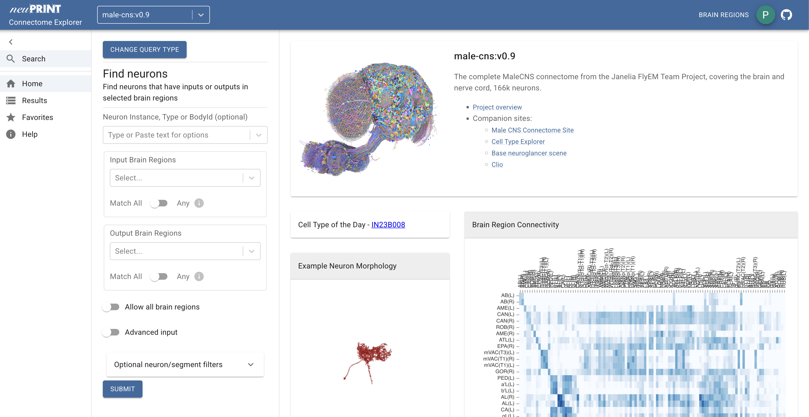

# :fontawesome-brands-wpexplorer: Explore the dataset

You have multiple options to interactively explore the dataset:

=== "NeuPrint"

    { width=70%}

    [NeuPrint](https://neuprint.janelia.org/) is a web-based platform for
    interactively exploring connectome data. You can search for neurons,
    visualize their morphology, and analyze their connectivity.

    [Go to NeuPrint](https://neuprint.janelia.org/?dataset=male-cns%3Av0.9&qt=findneurons){ .md-button }

=== "Neuroglancer"

    <!-- This is the container for the neuroglancer frame -->
    

        

            <iframe src="https://neuroglancer-demo.appspot.com/#!gs://flyem-user-links/short/2025-10-07.053121.364023.json" width="100%" height="500px" style="border:none;"></iframe>
             
            <a href="https://neuroglancer-demo.appspot.com/#!gs://flyem-user-links/short/2025-10-07.053121.364023.json" target="_blank">Open in new tab</a>
        

    

    Neuroglancer is a web-based platform for visualizing large-scale 3D data. You can explore the
    image data, segmentation and synapse detection in 3D. The above neuroglancer scene contains the following layers:

     - `em-clahe`: the EM image data; try pressing _space_ to toggle the view
     - `cns-seg`: the neuron segmentation; this layer is currently active - try changing the current search term from "DNa01" to e.g. "DP1m"
     - `brain/vnc-neuropil-shell`: layers for the neuropil outlines
     - `presyn`/`postsyn`: toggle the layers by clicking on them to show pre- and postsynaptic sites for the currently selected neurons

    In addition to the above visible layers, the scene contains a number of "archived" layers that you can enable by clicking on the little
    stack button in the top right corner where it says "6/37". Among others you will find:

     - `flywire-meshes`: neuron meshes from the FlyWire connectome (v783) transformed into maleCNS space
       for co-visualization
     - `hemibrain-meshes`: neuron meshes from the hemibrain (v1.2.1) connectome transformed into maleCNS space
       for co-visualization
     - `brain-/vnc-defects`: these layers show areas with known data defects/artefacts

=== "Dimorphism Explorer"

    For a summary of dimorphic neurons, including their morphology and connectivity,
    please visit our Dimorphism Explorer.

    [Go to Dimorphism Explorer](../build/dimorphism_overview.md){ .md-button }

------------------------------------------------------------------

    
This project is a collaboration between FlyEM (HHMI Janelia), the University of Cambridge (Dept. of Zoology), the MRC Laboratory of Molecular Biology, and Google Research.

    
    
    
    
    
    

    
The Male CNS dataset is <a href="https://creativecommons.org/licenses/by/4.0/">licensed under CC-BY.</a>

