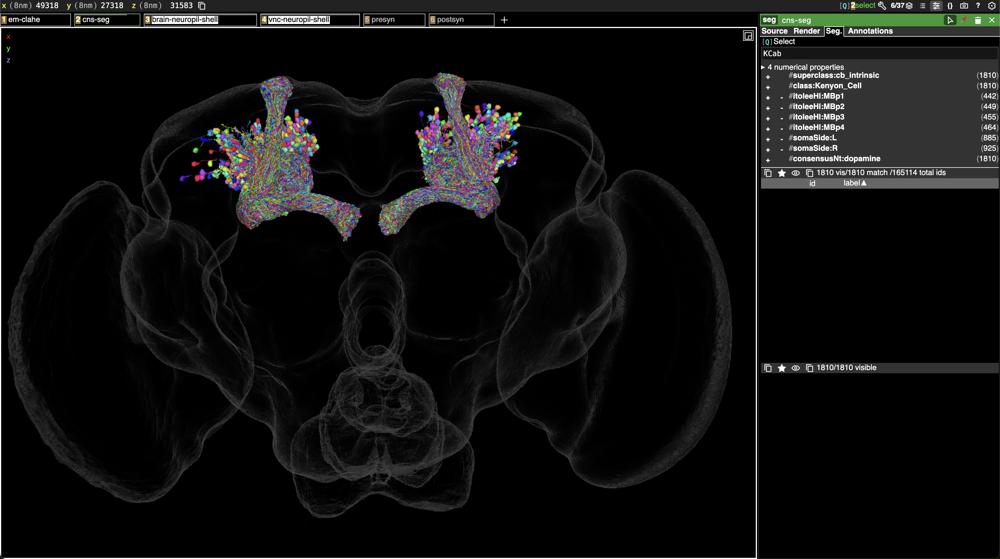

# :fontawesome-brands-wpexplorer: Explore the dataset

You have multiple options to interactively explore the dataset:

=== "NeuPrint"

    { width=70%}

    [NeuPrint](https://neuprint.janelia.org/) is a web-based platform for
    interactively exploring connectome data. You can search for neurons,
    visualize their morphology, and analyze their connectivity.

    [Go to NeuPrint](https://neuprint.janelia.org/?dataset=male-cns%3Av0.9&qt=findneurons){ .md-button }

=== "Neuroglancer"

    { width=70% }

    [Neuroglancer](https://neuroglancer-demo.appspot.com/) is a web-based
    platform for visualizing large-scale 3D data. You can explore the
    image data, segmentation and synapse detection in 3D.

    Clicking on the button below will open a neuroglancer scene with:

     - layers for the male CNS connectome data (image data, segmentation), including searchable annotations
     - a layer with overall brain outlines
     - a layer for individual neuropils
     - layers for pre- and postsynaptic sites
     - layers with neuron meshes from the hemibrain and FlyWire connnectomes transformed into maleCNS space
       for co-visualization (see archived layers in the layer panel)

    [Go to Neuroglancer](https://neuroglancer-demo.appspot.com/#!gs://flyem-user-links/short/MaleCNS-v0.9-brain.json){ .md-button }

=== "Dimorphism Explorer"

    For a summary of dimorphic neurons, including their morphology and connectivity,
    please visit our Dimorphism Explorer.

    [Go to Dimorphism Explorer](../build/dimorphism_overview.md){ .md-button }.

