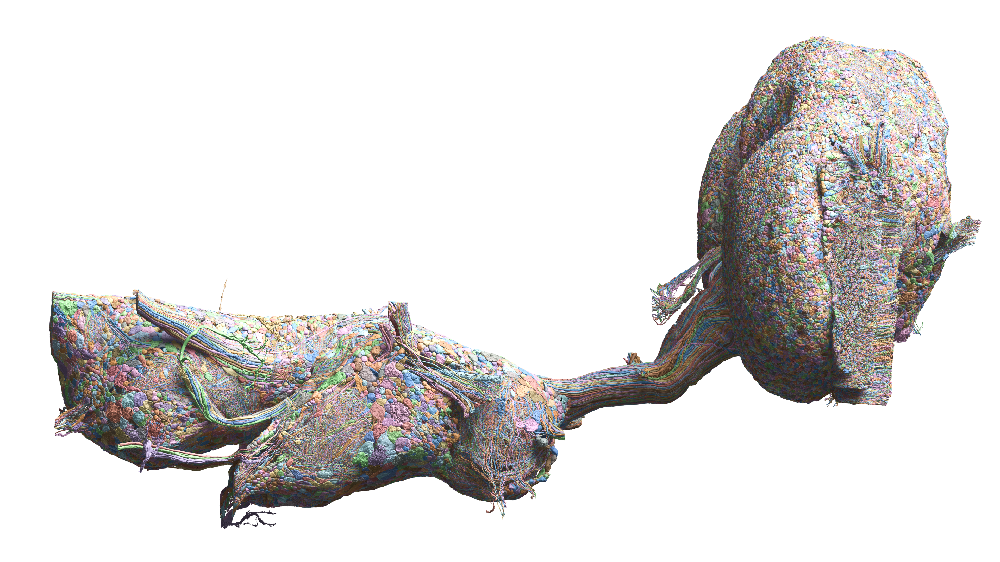
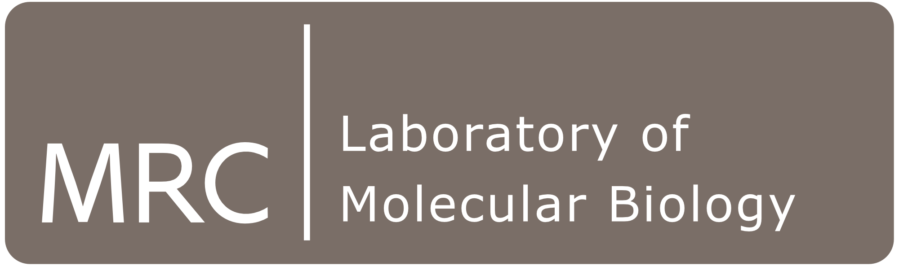

<!--if you don't want the big title, uncomment the h1 and comment out the next div-->

<!--<h1 style="display: none;">Male CNS Connectome</h1>-->

    <h1 style="font-size: 3em;">Male CNS Connectome Project Page</h1>

    
    
Lateral rendering of the male CNS connectome.

-   :fontawesome-solid-images:{ .lg .middle } __Overview__

    ---

    Read about the Fly EM Project's reconstruction of the connectome of the full _Drosophila_ male CNS.

    [:octicons-arrow-right-24: Janelia Blog Post](https://www.janelia.org/project-team/flyem/male-cns-connectome)

    [:octicons-arrow-right-24: BioRxiv Preprint](https://www.biorxiv.org/content/10.1101/2025.10.09.680999v2)

-   :material-newspaper:{ .lg .middle } __News__

    ---

    - **2026-06-08** - [MaleCNS v1.0 released](release.md)!
    - **2025-11-07** - [NeuronBridge](https://neuronbridge.janelia.org/) now provides matches for the MaleCNS!
    - **2025-10-30** - [Preprint v2](https://www.biorxiv.org/content/10.1101/2025.10.09.680999v2) available on bioRxiv!
    - **2025-10-03** - [MaleCNS v0.9 released](release.md)!

-   :material-compass-outline:{ .lg .middle } __Explore cell types__

    ---

    Browse cell types, connectivity, and eyemaps for the full male CNS.

    [:octicons-arrow-right-24: Male CNS Cell Type Explorer](https://reiserlab.github.io/celltype-explorer-drosophila-male-cns)

-   :material-gender-male-female:{ .lg .middle } __Compare__

    ---

    Inspect differences between the male and female fly brain in the
    dimorphic neurons catalogue.

    [:octicons-arrow-right-24: Dimorphism Explorer](build/dimorphism_overview.md)

-   :fontawesome-solid-circle-nodes:{ .lg .middle } __Query__

    ---

    Interactively search cell-to-cell connectivity using neuPrint.  Or try Clio's annotation-focused view of the data to conveniently filter cells by type, hemilineage, etc.

    [:octicons-arrow-right-24: NeuPrint](https://neuprint.janelia.org/?dataset=male-cns%3Av1.0&qt=findneurons)

    [:octicons-arrow-right-24: Clio](https://clio.janelia.org/ws/annotate?dataset=male-cns:v1.0-v1.0&tab=bodies)

-   :material-cloud-download-outline:{ .lg .middle } __Download__

    ---

    Download or programmatically query the data: images, annotations, synapses, skeletons, etc.

    [:octicons-arrow-right-24: Downloads](download.md)

-   :fontawesome-solid-images:{ .lg .middle } __Gallery__

    ---

    Browse videos and images about the Male CNS.

    [:octicons-arrow-right-24: Media Gallery](media.md)

-   :fontawesome-solid-list:{ .lg .middle } __Release Notes__

    ---

    Read about the data sources for Fly EM Project's reconstruction of the connectome of the full _Drosophila_ male CNS.

    [:octicons-arrow-right-24: Release Notes](release.md)

    
This project is a collaboration between FlyEM (HHMI Janelia), the University of Cambridge (Dept. of Zoology), the MRC Laboratory of Molecular Biology, and Google Research.

    
    
    
    

    
The Male CNS dataset is <a href="https://creativecommons.org/licenses/by/4.0/">licensed under CC-BY.</a>

